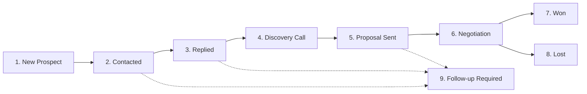

# Customer Acquisition & Prospect Pipeline Guide

**Operating Collective:** The Sorted Club  
**Version:** 1.0.0  
**Central System:** The Sorted Club Admin CRM (`/admin/crm`)

---

## 1. The 9-Stage Prospect Pipeline

Every prospect moves systematically through 9 defined stages from initial identification to project completion:

| Stage ID | Stage Display | Definition & Trigger |
| :--- | :--- | :--- |
| **`NEW`** | **New Prospect** | Sourced via outbound research (Instagram, LinkedIn, Google Maps, Directories) or inbound inquiry brief. |
| **`CONTACTED`** | **Contacted** | Initial outreach message dispatched via Instagram DM, WhatsApp, Cold Email, or LinkedIn. |
| **`REPLIED`** | **Replied** | Prospect has responded, expressed interest, or asked a question. |
| **`DISCOVERY_CALL`** | **Discovery Call** | 15–20 minute consultation scheduled or completed; requirements and qualification scored. |
| **`PROPOSAL_SENT`** | **Proposal Sent** | Official commercial proposal generated and link sent via `/proposal/[token]`. |
| **`NEGOTIATION`** | **Negotiation** | Client is reviewing pricing, scope adjustments, or timeline before formal sign-off. |
| **`WON`** | **Won** | Proposal accepted, contract signed, and initial 50% deposit received. Converted to Client. |
| **`LOST`** | **Lost** | Prospect declined, chose alternative, or went cold after complete follow-up cadence. |
| **`FOLLOW_UP_REQUIRED`**| **Follow-up Required**| Follow-up timer due (3-day, 7-day, or post-proposal reminder). |

---

## 2. Prospect Record Fields

Every prospect profile in The Sorted Club CRM captures:

1. **Business Basics:**
   - Business Name (`business_name`)
   - Business Category (`business_type` e.g. Restaurants, Clinics, Real Estate, Coaching, E-commerce)
   - Contact Person Name (`name`)
   - Direct Email (`email`)
   - Phone / WhatsApp Number (`phone`)
   - Current Website or Social Profile URL (`website`)

2. **Outreach & Discovery Intelligence:**
   - Problem Noticed (`problem_noticed` / `problem` e.g. "Slow 6s mobile load, broken booking button, no WhatsApp CTA")
   - Relevant Template Blueprint (`relevant_template` e.g. `apex-agency`, `savory-bites`, `lumina-salon`)
   - Estimated Budget (`budget` / `estimated_value`)
   - Lead Source (`source` e.g. Instagram DM, LinkedIn, WhatsApp, Website, Referral)

3. **Qualification & Health:**
   - 6-Point Qualification Score (`qualification_score` from 0 to 6)
   - Has Real Business (`has_real_business`)
   - Has Clear Need (`has_clear_need`)
   - Has Budget (`has_budget`)
   - Has Timeline (`has_timeline`)
   - Is Decision Maker (`is_decision_maker`)
   - Responds to Communication (`responds_communication`)

4. **Follow-Up & Cadence:**
   - Last Contacted Date (`last_contacted_at`)
   - Next Follow-Up Date (`next_follow_up_at`)
   - Internal Working Notes & Activity Log (`notes`, activities)

---

## 3. Systematic Follow-Up Cadence

To maximize close rates while maintaining a professional reputation:

1. **Day 0:** Initial personalized message sent (Instagram DM, WhatsApp, Email, or LinkedIn).
2. **Day 3 (+72 Hours):** Gentle follow-up referencing demo blueprint or video preview.
3. **Day 7 (+1 Week):** Second polite check-in with free consultation offer.
4. **Post-Proposal (+48 Hours):** Check-in on tokenized proposal link to answer questions and lock in sprint dates.
5. **Close of Cadence:** If no response after 3 attempts, mark stage as `LOST` (Cold) and archive without spamming.
